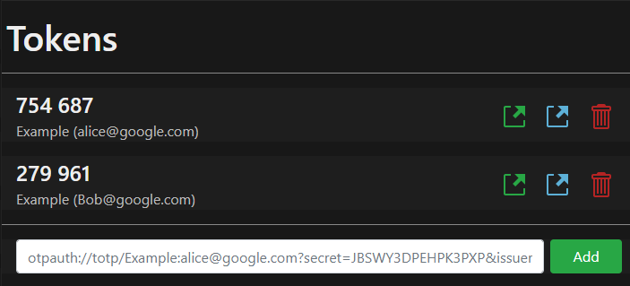

# 2fa
## Description
A slim PWA for managing TOTP-secrets. It supports scanning of QR-codes and
exporting of TOTP-secres via QR-codes.
The PWA is installable and is fully avalible offline.



## Features
- Can be installed.
- The website is availible offline.
- TOPT secrets can be exported.
- Qrcodes can be scanned and added.

## Security
Everything is stored on the client, at no point are any secrets on any server,
thus there is a minimal attack surface. The server only serves static content XSS is therefor not a risk.

## Contibute / Install

To compile simply run 
``` docker-composr up --build```
The webserver will listen on ``` 127.0.0.1:1235``` (can be changes in docker-compose.yml)
